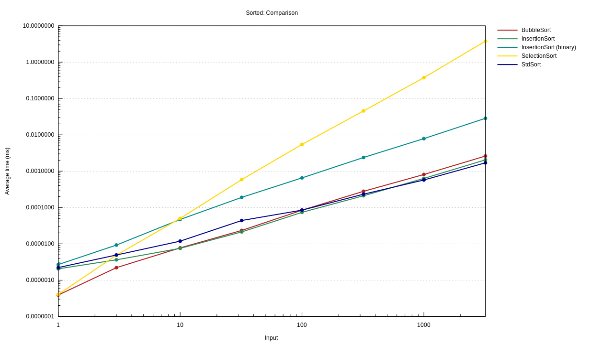
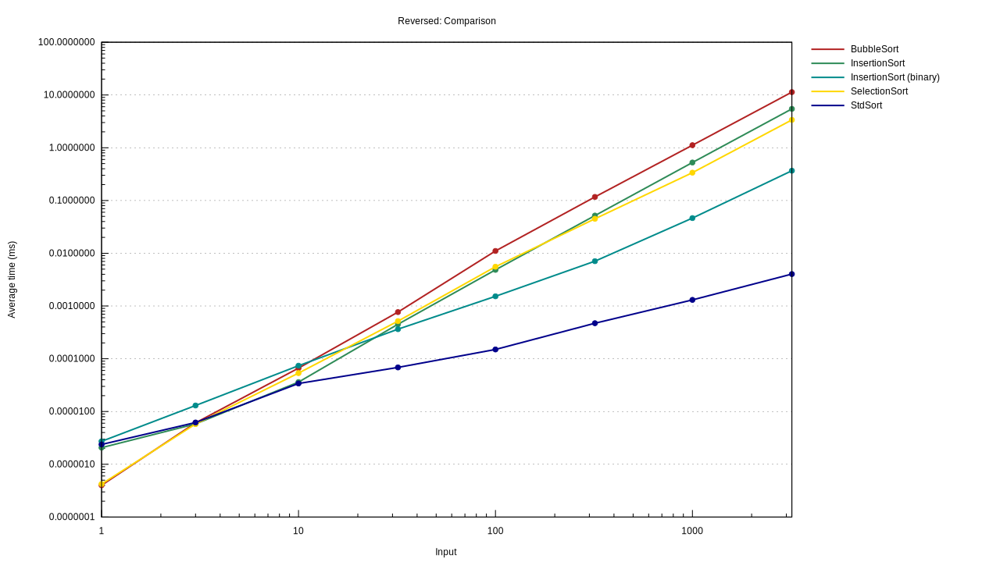
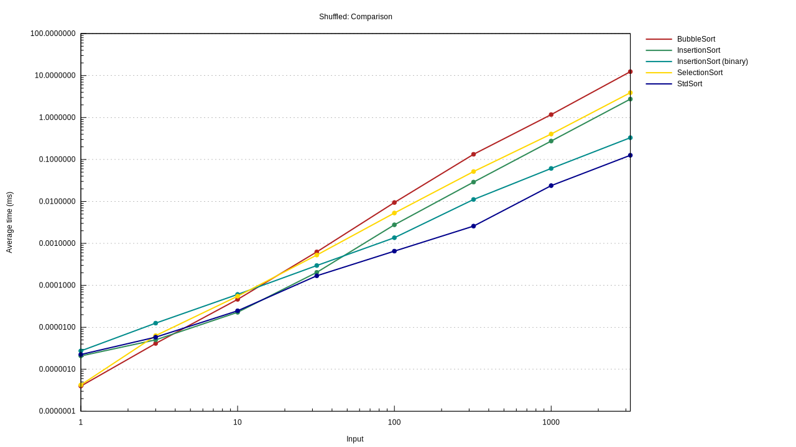

Sorting Explorer
================

An exploration of various sorting algorithms.

It is inspired by the similar project
[https://github.com/FedericoStra/Sorting](https://github.com/FedericoStra/Sorting),
which compares the performance of various sorting algorightms written in `C`.

Current status
--------------

This project is a work in progress.

The foundation and the structure of the library are laid out, we just need more
algorithms need to be implemented.

Benchmarks
----------

### Plots

#### Sorted array

#### Reversed array

#### Shuffled array

